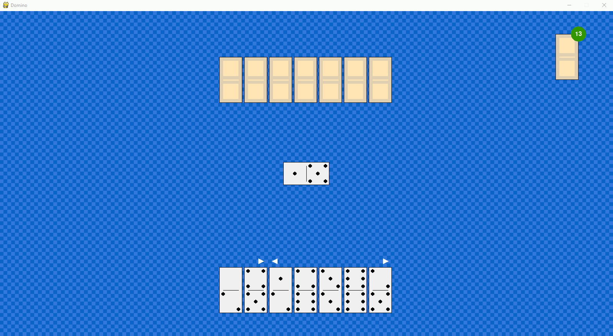
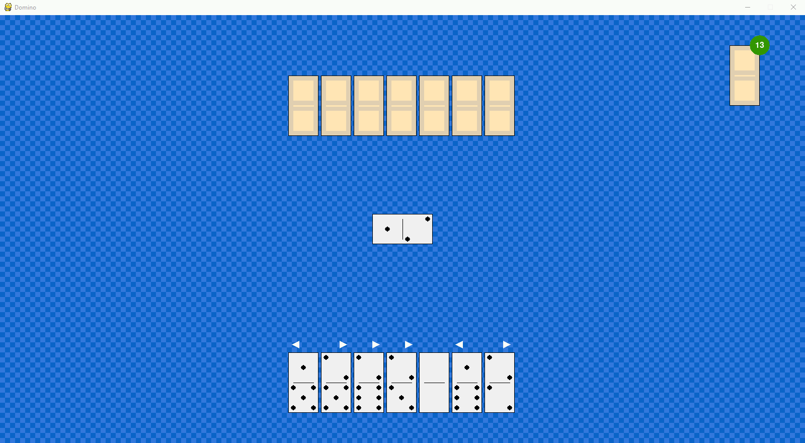
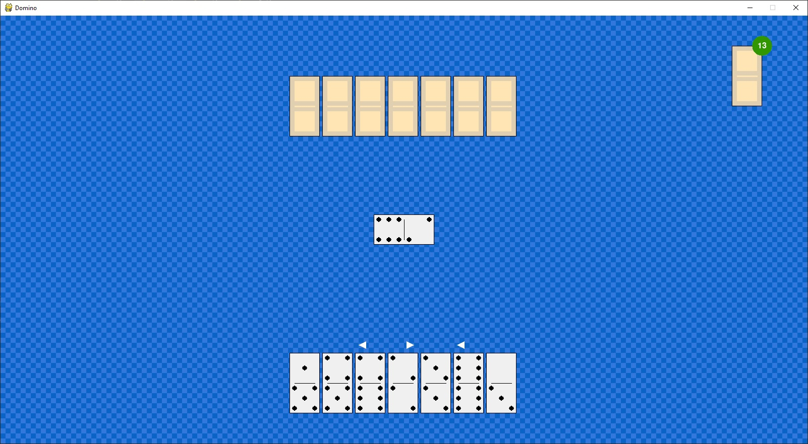
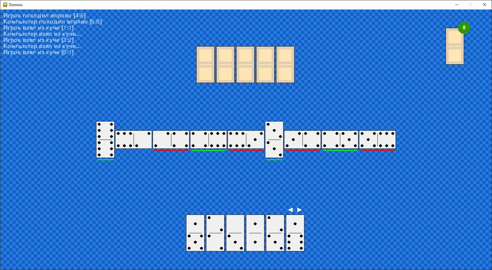
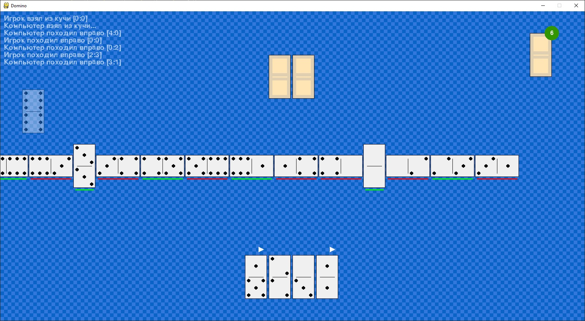
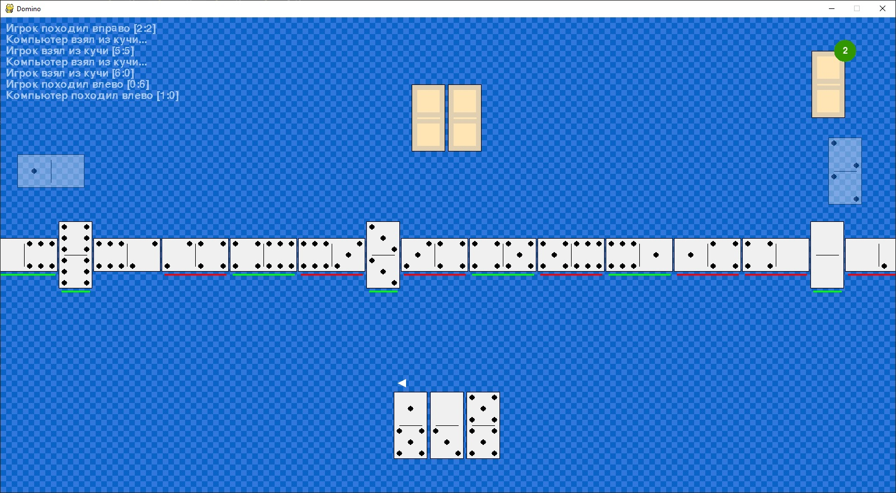
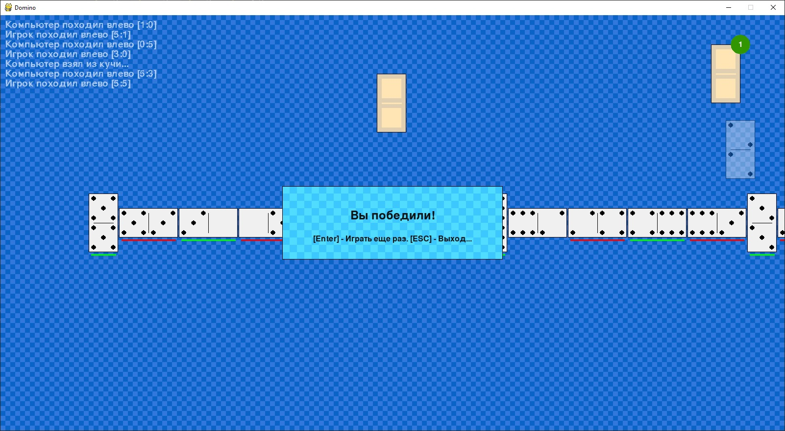

# Domino
Домино на Python

Игра на pygame. Проект написан с использованием библиотеки pygame. 
Файлы проекта:
- start.pyw. 
  С этого файла начинается выполнение программы. Он содержит основной цикл pygame, а также код, создающий объекты всех основных классов. Функционирование программы построено на     взаимодействии между объектами и изменении ими внутреннего состояния друг друга.
- classes.py. Файл со всеми классами игры
- utils.py. Файл с общими разделяемыми функциями и функциями отрисовки слоёв.
- settings.py. Файл с настройками (настройки цветов, размеров и положений объектов т.п.)

Классы в модуле classes:
- Domino. Служит для представления и отображения отдельных домино.
- Chain. Служит для хренения и отображения цепочки домино. Домино в цепочке поставленные игроком и компьютером различаются по цвету (зеленый - игрок, красный - компьютер).
- Scope. Служит для вывода на экран текущего видимого участка цепочки.
- EdgePane. Служит для отображения панелей с домино на концах цепочки. Вся цепочка домино может не помещаться на экране и чтоб можно было быстро посмотреть, какие домино сейчас находятся на невидимых концах и предусмотрен данный класс. Экземпляр данного класса отслеживает цепочку и выводит невидимые домино по краям, чтобы игроку не пришлось      постоянно скроллить колесиком мыши или кнопками со стралками (влево и вправо). Также можно кликать на сами панели для быстрой прокрутки цепочки влево или вправо.
- Storage. Хранилище домино - база, из которой могут брать домино игрок и компьютер.
- PLayerPool. Домино игрока.
- CmpPool. Домино компьютера.
- Logger. Выводит список последних действий игрока и компьютера.
- Ai. Отвечает за выбор хода компьютера.

Так как домино - это игра, в которой нет полной информации о возможных действиях другого игрока (в отличие, например, от шахмат, в которых позиции всех фигур на доске видны обоим игрокам), то для расчета очередного хода невозможно применить распространенный в шахматах/шашках и им подобных играх алгоритм минимакс (альфа/бета отсечение). И для оценки очередного хода приходится применять определенный набор эвристических правил.
Я применил три таких правила:
1) Надо стремиться избавляться от дублей. Ход дублем тем ценнее, чем больше домино с его мастью уже вышло из игры.
2) Надо стремиться ставить в цепочку домино с такими мастями, чтобы вероятность их нахождения у игрока на руках была минимальной. Например, у нас есть цепочка, которая оканчивается на 5 и 2. И три домино в пуле - 2:3, 5:3 и 2:6. Мы видим, что тройки уже все вышли и все оставшиеся тройки находятся у нас на руках. Тогда можно пойти 5:3 и заблокировать игроку одну сторону цепочки, оставив её открытой для себя.
3) Нужно отслеживать состояние цепочки в тот момент, когда игрок берет домино из кучи. Те масти, которые находятся в этот момент на концах цепочки - отсутствуют у игрока. И нужно стремиться снова выставить их на концы цепочки, чтобы игрок пропускал ход или вновь добирал домино из кучи.

